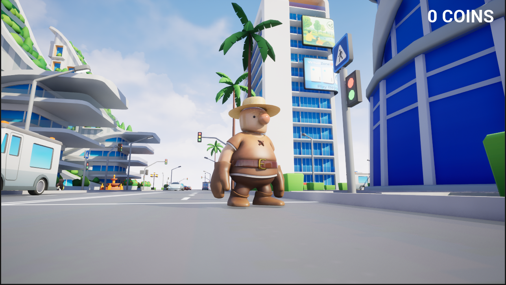
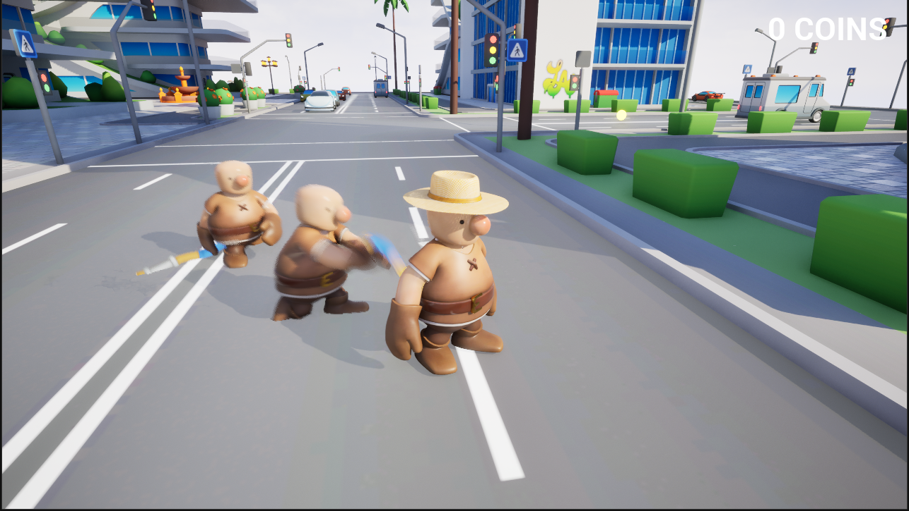
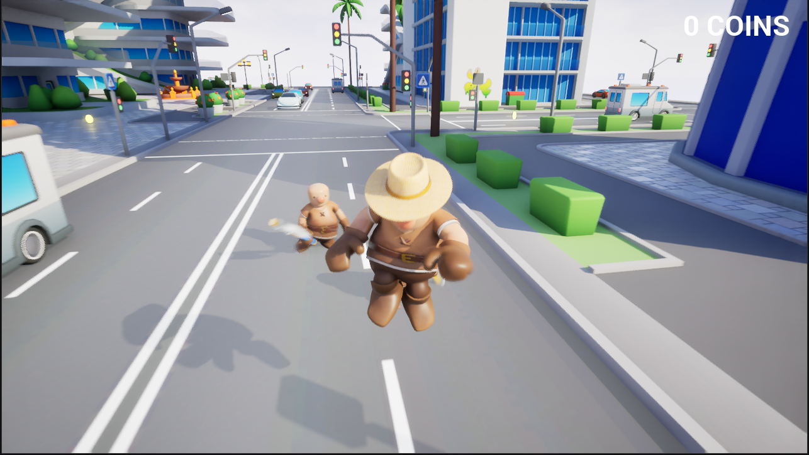
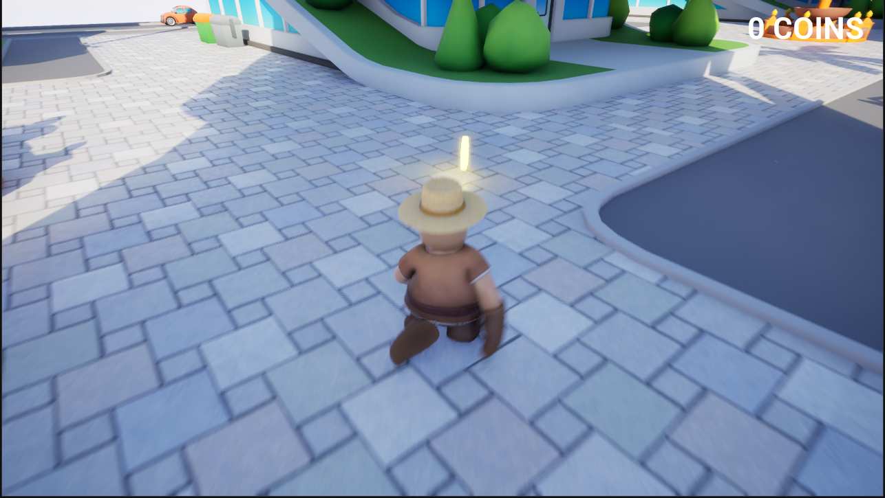

# Coinbound City

Coinbound City is a small Unreal Engine 5.7 project I made while learning third-person gameplay systems.

Right now it is a prototype, not a finished game. The main goal was to practice building a playable character, simple enemy behavior, coin pickups, and a basic UI counter inside a stylized city level.

## Screenshots

## What I Worked On

- Third-person character movement
- Basic enemy setup
- Coin pickup behavior
- Coin counter UI
- Level setup inside Unreal Engine
- Testing gameplay inside a standalone preview window

## Project Notes

This is a learning project. I followed tutorial material from [GorkaGames](https://www.youtube.com/@GorkaGames) while building it, so this repo should be read as practice work, not as a fully original commercial game.

Some assets come from the tutorial source, and the map/environment assets are free assets from Fab for Unreal Engine. I do not claim ownership of third-party assets used for learning.

## Opening The Project

1. Install Unreal Engine 5.7.
2. Clone the repository.
3. Open `FirstGame.uproject`.

## Status

This project is still early. I am using it to learn Unreal Engine workflow, Blueprints, gameplay logic, and how to keep a game project documented properly on GitHub.
